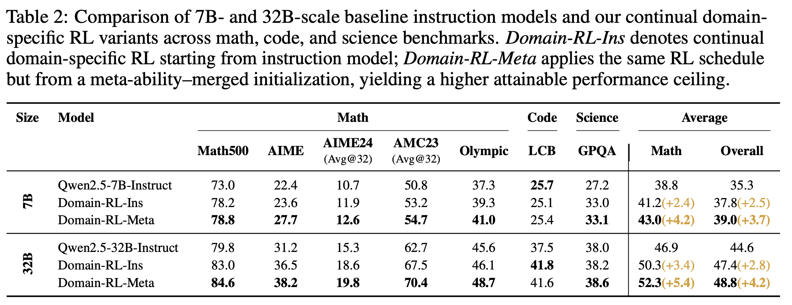

<h1 align="center">Meta-Ability-Alignment</h1>

<p align="center">
  <a href="https://arxiv.org/abs/2505.10554">
    
  </a>
  <a href="https://huggingface.co/spaces/zhiyuanhucs/Meta-Ability-Alignment">
    
  </a>
  <a href="https://huggingface.co/papers/2505.10554">
    
  </a>
  <a href="https://huggingface.co/zhiyuanhucs/7b-Domain-RL-Meta">
    
  </a>
</p>

<blockquote align="center"><strong>Beyond “Aha!” — Toward Systematic Meta-Abilities Alignment in Large Reasoning Models</strong><br><em>Zhiyuan Hu et al., 2025</em></blockquote>


---

## 1 Overview

This repository provides **code, data generators, training scripts, and checkpoints** for the three-stage pipeline described in the paper:

1. **Stage A – Meta-Ability Alignment**  
   Independently align three reasoning abilities: Deduction, Induction, and Abduction.
2. **Stage B – Parameter-Space Merging**  
   Merge the three specialist models into a single checkpoint at zero extra cost.
3. **Stage C – Domain-Specific RL**  
   Continue training from the merged model on downstream domains (such as Math) to push the ceiling higher.

All generators are **program-verifiable**; no human annotation is needed.  

[Overall Framework](images/framework.jpg)

---

## 2 News 📰

| Date (YYYY-MM-DD) | Update |
|-------------------|--------|
| 2025-05-27 | 🚀 Code & 7 B checkpoints released, 32B model checkpoints will come soon |
| 2025-05-15 | Paper v1 uploaded to arXiv |

Feel free to open Issues or start a Discussion to share your results! 🎉

---

## 3 Get Started 🌟

### 2.1 Environment

```bash
# Python ≥ 3.10
conda create -n maa python=3.10
conda activate maa

# Core deps
pip install -r requirements.txt      # transformers, accelerate, bitsandbytes, …
pip install -e ./mergekit            # if not pulled automatically
```

### 2.2 Data Generation

```bash
# Deduction –  Propositional Satisfiability
python Data_Synthesis/Deduction.py

# Induction – Masked-Sequence Completion
python Induction/Induction.py

# Abduction – Reverse Rule-Graph Search
python Data_Synthesis/Abduction.py
```

Data are written to Data_Synthesis/{Deduction,Induction,Abduction}\_dataset/{1,2,…}.jsonl by default.

### 2.3 Train Specialist Models (Stage A)

```bash
# Example: Deduction-7B
bash Training/scripts/train_deduction_7b.sh
```

Each script contains VERL + REINFORCE++ objectives, curriculum schedules, and reward settings. We modified the `_select_rm_score_fn` function in `main_ppo.py` and `mix.py`, as well as in `Deduction.py`, `Induction.py`, and `Abduction.py` (under `utils/reward_score`), based on the original VeRL and Logic-RL implementations.


### 2.4 Model Merging (Stage B)

Follow the instructions to set up the environment using the code from `https://github.com/arcee-ai/mergekit`, and then use the provided utilities to execute the merge.


```bash
mergekit-yaml merge/merge_meta.yml ./merge-Deduction-Induction-Abduction --cuda
```
merge_meta.yaml uses the paper’s best weights

### 2.5 Continue Training (Stage C)

## 4 Performans 📈

### Table 1  


### Table 2  



## 5 Contact 📬

- **Zhiyuan Hu** – zhiyuan_hu@u.nus.edu  
- Found a bug or performance gap? Please open an Issue or email us.  
- Industry / research collaboration inquiries are welcome!

## 6 Citation 📄

If you use this project, please cite:

```bibtex
@article{hu2025beyond,
  title={Beyond'Aha!': Toward Systematic Meta-Abilities Alignment in Large Reasoning Models},
  author={Hu, Zhiyuan and Wang, Yibo and Dong, Hanze and Xu, Yuhui and Saha, Amrita and Xiong, Caiming and Hooi, Bryan and Li, Junnan},
  journal={arXiv preprint arXiv:2505.10554},
  year={2025}
}
